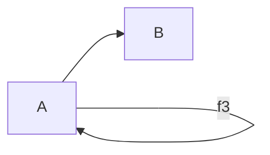

# Category Theory 1.2: What is a category?

* Composition
* Identity

* Morphism (arrow)
* Objects

## 連結
* [影片連結](https://www.youtube.com/watch?v=p54Hd7AmVFU&t=514s)

<!--stackedit_data:
eyJoaXN0b3J5IjpbLTIxMzIyMDExMzcsMTAzMjIyNTE3OCwtNz
AwMTkyMDQxXX0=
-->