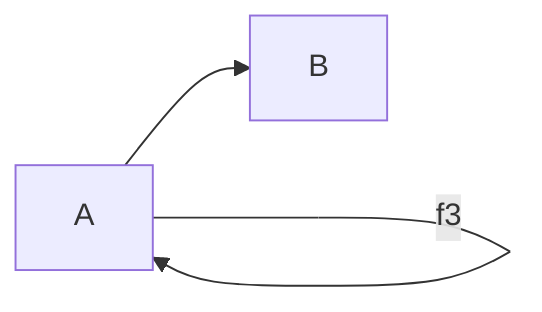

# Category Theory 1.2: What is a category?

[影片連結](https://www.youtube.com/watch?v=p54Hd7AmVFU&t=514s)

* Composition
* Identity

* Morphism (arrow)
* Objects

##
<!--stackedit_data:
eyJoaXN0b3J5IjpbLTcwMDE5MjA0MV19
-->