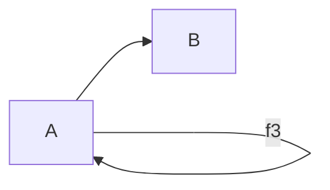

# Category Theory 1.2: What is a category?

* Composition
* Identity

* Morphism (arrow)
* Objects

```mermaid
graph LR
A --> B
A -- f1 --> A
A -- f2 --> A
A -- f3 --> A
```
<!--stackedit_data:
eyJoaXN0b3J5IjpbLTU5MTExOTU5Ml19
-->